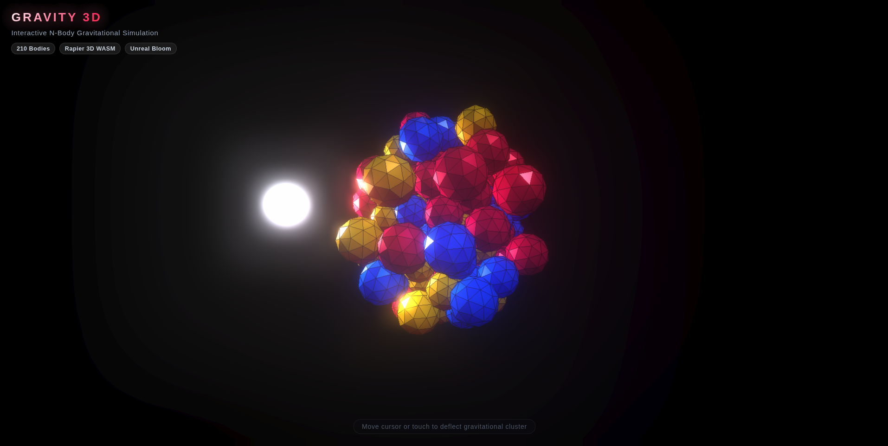

# 🌌 Gravity 3D



An interactive, high-performance 3D N-body gravitational physics simulation built with **[Three.js](https://threejs.org/)**, **[Rapier 3D](https://rapier.rs/)** (WebAssembly), and **[Vite](https://vitejs.dev/)**.

Hundreds of faceted icosahedral bodies are pulled toward a central gravitational singularity while colliding and tumbling in real-time 3D space. Users interact with the cluster via an emissive kinematic cursor sphere that deflects and scatters bodies with dynamic lighting and Unreal Bloom post-processing.

---

## ✨ Features

- **⚡ Rapier 3D WASM Physics**: Hardware-accelerated rigid body dynamics, collision detection, impulses, restitution, and rotational kinematics.
- **🪐 Central Gravitational Field**: Continuous inward attraction pulling 200+ bodies into an orbiting, pulsing cluster.
- **✨ Full Rotational Physics**: Three.js visual meshes synchronize position and quaternion orientation with Rapier rigid bodies for realistic physical rolling and collisions.
- **💡 Interactive Kinematic Deflector**: Mouse/touch-driven glowing ball with dynamic point lighting that interacts with the physics world in real time.
- **🌟 Unreal Bloom Post-Processing**: Emissive glow and high-pass bloom effects powered by Three.js `EffectComposer` and `UnrealBloomPass`.
- **📱 Responsive & Touch-Ready**: Automatically adapts to window resize, high-DPI (Retina) screens, and mobile/touch pointers.
- **🏗️ Modular Architecture**: Clean, scalable ES module layout separating physics, entities, visual effects, and UI styling.

---

## 📁 Project Structure

```
gravity3D/
├── index.html                 # Main HTML entry point with canvas root, HUD, and loader
├── main.js                    # Core app bootstrap, scene, camera, render loop, and events
├── style.css                  # Canvas styling, modern HUD overlay, and loading screen
├── home.png                   # Project preview screenshot
├── package.json               # Project metadata, dependencies, and build scripts
├── package-lock.json          # Dependency lockfile
├── vite.config.js             # Vite build and development configuration
├── README.md                  # Project documentation
├── physics/
│   └── world.js               # Rapier 3D WASM initialization and physics world management
├── entities/
│   ├── bodies.js              # Dynamic body cluster generator, materials, and gravity pull
│   └── mouseBall.js           # Kinematic cursor-tracking ball with glowing light & collider
└── effects/
    └── postprocessing.js      # EffectComposer and UnrealBloomPass configuration
```

---

## 🚀 Getting Started

### Prerequisites

- [Node.js](https://nodejs.org/) (version 18 or higher recommended)
- [npm](https://www.npmjs.com/) or another package manager (pnpm, yarn)

### Installation

Clone the repository and install dependencies:

```bash
git clone <repository-url>
cd gravity3D
npm install
```

### Development Server

Run the local Vite development server with hot module replacement (HMR):

```bash
npm run dev
```

Open your browser at `http://localhost:5173/` (or the URL provided in the console).

### Production Build

Create an optimized production bundle in the `dist/` directory:

```bash
npm run build
```

### Preview Production Build

Preview the production bundle locally:

```bash
npm run preview
```

---

## 🎮 Controls & Interaction

| Input | Action |
| :--- | :--- |
| **Mouse Move** | Moves the glowing kinematic ball to deflect orbiting bodies |
| **Touch / Drag** | Moves the kinematic ball on mobile and touch devices |
| **Window Resize** | Viewport, camera frustum, and post-processing buffers adapt dynamically |

---

## ⚙️ Customization

Key parameters can be configured across modular source files:

- **Body Count & Gravity**: In [`main.js`](main.js), adjust `numBodies` or pass options to `createBodyCluster`:
  ```javascript
  const cluster = createBodyCluster(RAPIER, world, scene, 210, {
    gravityStrength: 0.5,
    range: 6.0,
  });
  ```
- **Color Palette**: In [`entities/bodies.js`](entities/bodies.js), edit `DEFAULT_COLORS` array:
  ```javascript
  const DEFAULT_COLORS = [0xff2a5f, 0x0077ff, 0xffd200];
  ```
- **Bloom Glow Parameters**: In [`main.js`](main.js), configure `initPostprocessing`:
  ```javascript
  const post = initPostprocessing(renderer, scene, camera, width, height, {
    strength: 2.0,  // Intensity of the bloom glow
    radius: 1.0,    // Blur spread radius
    threshold: 0.005 // Luminosity threshold
  });
  ```
- **Mouse Ball Collider & Light**: In [`entities/mouseBall.js`](entities/mouseBall.js), tweak `mouseSize`, `colliderMultiplier`, and `lightIntensity`.

---

## 🛠️ Tech Stack

- **[Three.js](https://github.com/mrdoob/three.js)** (`^0.168.0`): WebGL 3D rendering library
- **[@dimforge/rapier3d-compat](https://rapier.rs/)** (`^0.21.0`): 3D physics engine compiled to WebAssembly
- **[Vite](https://vitejs.dev/)** (`^5.4.1`): Next-generation frontend build tool and dev server

---

## 📄 License

MIT License. Feel free to use, modify, and distribute for personal or commercial projects.
